# ERD Final - Preparation Phase

Date: 2026-02-18  
Status: draft final (for build in Phase-2)  
Method: derived from source code only.

## 1) Source of truth references

Primary references used:
1. `prisma/schema.prisma:126` (`TourProduct`) until `prisma/schema.prisma:586` (`TourExclusion`) in `balisnap`.
2. `prisma/schema.prisma:332` (`BookingItem`) and `prisma/schema.prisma:437` (`Booking`) in `balisnap`.
3. `d:/Balisnaptrip/WEB/bstadmin/prisma/schema.prisma:242` (`Tour`) and `d:/Balisnaptrip/WEB/bstadmin/prisma/schema.prisma:259` (`TourPackage`).
4. `d:/Balisnaptrip/WEB/bstadmin/prisma/schema.prisma:542` (`TourCostPattern`) until `d:/Balisnaptrip/WEB/bstadmin/prisma/schema.prisma:650` (`BookingFinanceItem`).
5. `d:/Balisnaptrip/WEB/bstadmin/prisma/schema.prisma:93` (`Booking`) and `d:/Balisnaptrip/WEB/bstadmin/prisma/schema.prisma:177` (`BookingEmail`).
6. `d:/Balisnaptrip/WEB/bstadmin/src/lib/email/booking-fetch.ts:365` (booking creation from parser output).

## 2) Final ERD (target schema)

```mermaid
erDiagram
  PRODUCT {
    int product_id PK
    string product_name
    string slug UK
    string short_description
    string description
    string category
    string country_code
    string region
    string base_meeting_point
    boolean is_featured
    boolean is_active
    int priority
    datetime created_at
    datetime updated_at
  }

  PRODUCT_MEDIA {
    int media_id PK
    int product_id FK
    string url
    string alt_text
    int sort_order
    boolean is_cover
  }

  VARIANT {
    int variant_id PK
    int product_id FK
    string variant_code
    string variant_name
    string service_type
    int duration_days
    int duration_nights
    int min_pax
    int max_pax
    string currency_code
    boolean is_default
    boolean is_active
    int booking_cutoff_hours
    string cancellation_policy
    datetime created_at
    datetime updated_at
  }

  VARIANT_MEDIA {
    int media_id PK
    int variant_id FK
    string url
    string alt_text
    int sort_order
    boolean is_cover
  }

  DEPARTURE {
    int departure_id PK
    int variant_id FK
    string departure_code UK
    datetime start_date
    datetime end_date
    datetime cutoff_at
    int capacity_total
    int capacity_reserved
    string status
    string meeting_point
    string note
    boolean is_active
  }

  RATE_PLAN {
    int rate_plan_id PK
    int variant_id FK
    string traveler_type
    decimal price
    string currency_code
    int min_quantity
    int max_quantity
    datetime valid_from
    datetime valid_to
    date season_start
    date season_end
    boolean is_active
  }

  VARIANT_ITINERARY {
    int itinerary_id PK
    int variant_id FK
    int day
    int sort_order
    string title
    string description
    string location
    time start_time
    time end_time
    int duration_minutes
  }

  VARIANT_HIGHLIGHT {
    int highlight_id PK
    int variant_id FK
    string description
    int sort_order
  }

  VARIANT_OPTIONAL_FEATURE {
    int feature_id PK
    int variant_id FK
    string description
    int sort_order
  }

  VARIANT_ADDITIONAL_INFO {
    int info_id PK
    int variant_id FK
    string description
    int sort_order
  }

  INCLUSION {
    int inclusion_id PK
    string description
  }

  VARIANT_INCLUSION {
    int variant_id FK
    int inclusion_id FK
    int sort_order
    string note
  }

  EXCLUSION {
    int exclusion_id PK
    string description
  }

  VARIANT_EXCLUSION {
    int variant_id FK
    int exclusion_id FK
    int sort_order
    string note
  }

  CHANNEL {
    int channel_id PK
    string code UK
    string name
    boolean is_active
  }

  CHANNEL_PRODUCT {
    int channel_product_id PK
    int channel_id FK
    int product_id FK
    string external_product_ref
    string display_name
    json content_payload
    string sync_state
    datetime last_synced_at
  }

  CHANNEL_VARIANT {
    int channel_variant_id PK
    int channel_product_id FK
    int variant_id FK
    string external_variant_ref
    string display_name
    string mapping_status
  }

  CHANNEL_RATE_RULE {
    int channel_rate_rule_id PK
    int channel_variant_id FK
    string traveler_type
    string pricing_mode
    decimal price_value
    string currency_code
    datetime valid_from
    datetime valid_to
  }

  CHANNEL_SYNC_LOG {
    int sync_log_id PK
    int channel_id FK
    string entity_type
    string external_ref
    string action
    string status
    json payload
    string error_message
    datetime synced_at
  }

  BOOKING {
    int booking_id PK
    string booking_ref UK
    string user_id
    datetime booking_date
    datetime travel_date
    string status_code
    string source_channel
    decimal total_amount
    string currency_code
    int number_of_adult
    int number_of_child
    string main_contact_name
    string main_contact_email
    string phone_number
    string pickup_location
    string meeting_point
    string note
    datetime created_at
    datetime updated_at
  }

  BOOKING_ITEM {
    int booking_item_id PK
    int booking_id FK
    int variant_id FK
    int departure_id FK
    string item_status
    int adult_qty
    int child_qty
    int infant_qty
    decimal adult_unit_price
    decimal child_unit_price
    decimal infant_unit_price
    decimal subtotal
    decimal discount_amount
    decimal tax_amount
    decimal total_amount
    json snapshot
  }

  BOOKING_TRAVELER {
    int traveler_id PK
    int booking_item_id FK
    string traveler_type
    string first_name
    string last_name
    string email
    string phone
    date birth_date
    string nationality
    string passport_number
    string special_request
  }

  PAYMENT_TRANSACTION {
    int payment_id PK
    int booking_id FK
    string user_id
    datetime payment_date
    decimal amount
    string currency_code
    string payment_method
    string payment_status
    string gateway
    string gateway_order_id
    string gateway_capture_id
    string payment_ref UK
    json raw_payload
  }

  BOOKING_SOURCE_EVENT {
    int source_event_id PK
    int booking_id FK
    int channel_id FK
    string external_booking_ref
    string relation_type
    string raw_email_id
    json payload
    datetime received_at
    datetime processed_at
  }

  LEGACY_PACKAGE_BRIDGE {
    int legacy_package_id PK
    int product_id FK
    int variant_id FK
    string source_system
  }

  FINANCE_CATEGORY {
    int category_id PK
    string code UK
    string name
    string default_direction
    string payee_mode
    boolean auto_driver
    boolean is_commission
    boolean allow_related_item
    boolean require_partner
    boolean is_active
  }

  PARTNER {
    int partner_id PK
    int category_id FK
    string name
    string pic_name
    string pic_whatsapp
    boolean is_active
  }

  SERVICE_ITEM {
    int service_item_id PK
    int category_id FK
    int default_partner_id FK
    string name
    boolean is_active
  }

  FINANCE_PATTERN {
    int pattern_id PK
    int variant_id FK
    int legacy_package_id
    string name
    boolean is_active
  }

  FINANCE_PATTERN_ITEM {
    int pattern_item_id PK
    int pattern_id FK
    int service_item_id FK
    int default_partner_id FK
    string default_unit_type
    int default_qty
    decimal default_price
    int position
  }

  BOOKING_FINANCE {
    int booking_finance_id PK
    int booking_id FK
    int pattern_id FK
    datetime assigned_at
    datetime validated_at
    boolean is_locked
    string notes
  }

  BOOKING_FINANCE_ITEM {
    int finance_item_id PK
    int booking_finance_id FK
    int service_item_id FK
    int partner_id FK
    string direction
    string payee_type
    string unit_type
    int unit_qty
    decimal unit_price
    decimal amount
    boolean paid
    datetime paid_at
  }

  PRODUCT ||--o{ PRODUCT_MEDIA : has
  PRODUCT ||--o{ VARIANT : has
  VARIANT ||--o{ VARIANT_MEDIA : has
  VARIANT ||--o{ DEPARTURE : has
  VARIANT ||--o{ RATE_PLAN : has
  VARIANT ||--o{ VARIANT_ITINERARY : has
  VARIANT ||--o{ VARIANT_HIGHLIGHT : has
  VARIANT ||--o{ VARIANT_OPTIONAL_FEATURE : has
  VARIANT ||--o{ VARIANT_ADDITIONAL_INFO : has
  VARIANT ||--o{ VARIANT_INCLUSION : has
  INCLUSION ||--o{ VARIANT_INCLUSION : linked
  VARIANT ||--o{ VARIANT_EXCLUSION : has
  EXCLUSION ||--o{ VARIANT_EXCLUSION : linked

  CHANNEL ||--o{ CHANNEL_PRODUCT : owns
  PRODUCT ||--o{ CHANNEL_PRODUCT : projected_to
  CHANNEL_PRODUCT ||--o{ CHANNEL_VARIANT : has
  VARIANT ||--o{ CHANNEL_VARIANT : mapped_to
  CHANNEL_VARIANT ||--o{ CHANNEL_RATE_RULE : priced_by
  CHANNEL ||--o{ CHANNEL_SYNC_LOG : logs

  BOOKING ||--o{ BOOKING_ITEM : has
  VARIANT ||--o{ BOOKING_ITEM : booked_as
  DEPARTURE ||--o{ BOOKING_ITEM : scheduled_on
  BOOKING_ITEM ||--o{ BOOKING_TRAVELER : has
  BOOKING ||--o{ PAYMENT_TRANSACTION : paid_by
  BOOKING ||--o{ BOOKING_SOURCE_EVENT : traced_by
  CHANNEL ||--o{ BOOKING_SOURCE_EVENT : originated_from

  PRODUCT ||--o{ LEGACY_PACKAGE_BRIDGE : bridge
  VARIANT ||--o{ LEGACY_PACKAGE_BRIDGE : bridge

  FINANCE_CATEGORY ||--o{ PARTNER : classifies
  FINANCE_CATEGORY ||--o{ SERVICE_ITEM : classifies
  PARTNER ||--o{ SERVICE_ITEM : defaults
  VARIANT ||--o{ FINANCE_PATTERN : drives
  FINANCE_PATTERN ||--o{ FINANCE_PATTERN_ITEM : has
  SERVICE_ITEM ||--o{ FINANCE_PATTERN_ITEM : uses
  BOOKING ||--o| BOOKING_FINANCE : has
  FINANCE_PATTERN ||--o{ BOOKING_FINANCE : assigned
  BOOKING_FINANCE ||--o{ BOOKING_FINANCE_ITEM : has
  SERVICE_ITEM ||--o{ BOOKING_FINANCE_ITEM : item_of
  PARTNER ||--o{ BOOKING_FINANCE_ITEM : payee
```

## 3) Traceability (why this ERD shape)

1. Product/Variant/Departure/RatePlan block comes directly from `balisnap` v2 models:
- `prisma/schema.prisma:126`, `prisma/schema.prisma:164`, `prisma/schema.prisma:212`, `prisma/schema.prisma:234`.

2. Booking itemized transaction block comes directly from:
- `prisma/schema.prisma:332` (`BookingItem`) and `prisma/schema.prisma:362` (`BookingTraveler`).

3. Legacy package bridge is required because both codebases still reference package IDs:
- `prisma/schema.prisma:382` (`balisnap.TourPackage`).
- `d:/Balisnaptrip/WEB/bstadmin/prisma/schema.prisma:259` (`bstadmin.TourPackage`).
- `lib/utils/booking/createBooking.ts:257` resolves `packageId` fallback chain.

4. Channel projection block is required because source data is channel-dependent:
- OTA source exists in `d:/Balisnaptrip/WEB/bstadmin/prisma/schema.prisma:164` (`BookingSource`).
- parser pipeline only stores booking-level refs (`src/types/email.ts:3`, `src/lib/email/booking-fetch.ts:365`), so explicit mapping entities are needed.

5. Finance block is retained from existing operational model:
- `d:/Balisnaptrip/WEB/bstadmin/prisma/schema.prisma:542` to `d:/Balisnaptrip/WEB/bstadmin/prisma/schema.prisma:650`.

## 4) Non-negotiable constraints from source

1. Keep itemized booking totals and payment validation semantics:
- `lib/utils/booking/compat.ts:4`
- `app/api/orders/[orderId]/capture/route.ts:156`

2. Keep booking status lifecycle compatibility:
- public web statuses (`waiting`, `paid`, `completed`, `cancelled`) are used in `app/bookings/BookingCard.tsx:21`.
- ops statuses (`NEW`, `READY`, `ATTENTION`, `COMPLETED`, `DONE`, `UPDATED`, `CANCELLED`, `NO_SHOW`) are computed in `d:/Balisnaptrip/WEB/bstadmin/src/lib/booking/status.ts:20`.

3. Keep role boundary:
- `bstadmin` admin-only behavior in `d:/Balisnaptrip/WEB/bstadmin/src/lib/auth.ts:36` and API guards in route files.
